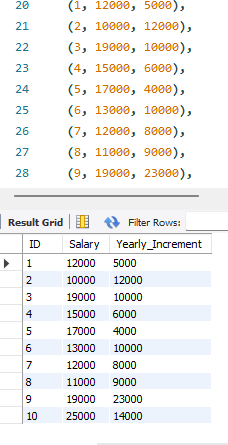

# Introduction to MySQL

This task will look into the basics of mysql such as creating databases, creating tables within databases, inserting rows of informations within a table, understanding various data types and constraints, retrieving specific informations. All these were possible using sql commands.

# Problem Statement 

- For this task, a database called "Staff" was created and within this database, two tables named Staff_Info(ID,Name, Age, Date_Of_Entry, Contract_Duration) and Staff_Salary(ID, Salary, Yearly_Increment) was to be created.
Each table was supposed to have at least 4 constraint and 10 rows of informations.

                                                                                

To create these tables the sql command "CREATE TABLE" was used, to input these informmations the command "INSERT" was used

- The next question in this task required retrieving specific column of informations from these tables.

  For the Staff_Info table the Name and Age of the staffs were retrieved an for the Staff_Salary table the ID and Salary were also retrieved

  

To retrieve these information from each table the command "SELECT" came in hand.

## Conclusion

This task aimed at testing understanding of basic commands in sql.

